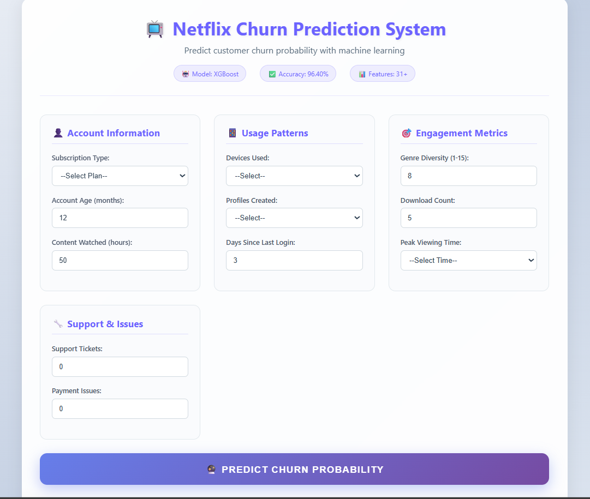
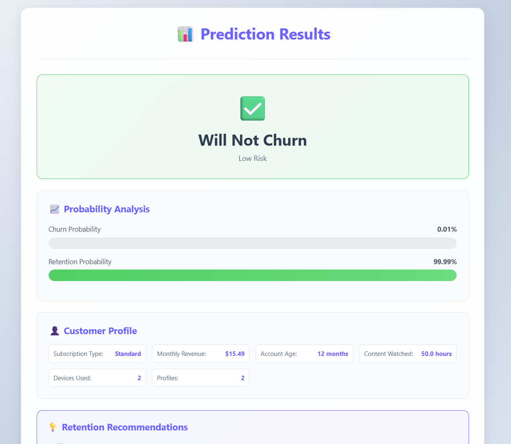

# 📺 Netflix Customer Churn Prediction System


A **Machine Learning powered web application** that predicts whether a Netflix customer is likely to **churn (cancel subscription)** based on their usage behavior, engagement metrics, and account activity.

This system helps businesses **identify customers at risk of leaving and take proactive retention actions** using data-driven insights.

---

# 🎯 Model Accuracy

**96.40% accuracy using XGBoost with 20+ engineered features**

The model analyzes user behavior including:

* Subscription type
* Account age
* Content watched hours
* Devices used
* Profiles created
* Payment issues
* Support tickets
* Login activity
* Genre diversity
* Download behavior

---

# 🚀 Project Overview

Customer churn prediction is a crucial problem for subscription-based platforms.

This project builds a **machine learning model and a Flask web application** that predicts the probability of churn and helps businesses improve customer retention strategies.

The system provides:

✔ Churn probability prediction
✔ Risk classification (Low / Medium / High)
✔ Retention recommendations
✔ Visual probability analysis

---

# 📸 Application Screenshots

### Input Page



### Prediction Result



---

# 🧠 Machine Learning Pipeline

```
Data Collection
      ↓
Data Preprocessing
      ↓
Feature Engineering
      ↓
Model Training
      ↓
Hyperparameter Optimization
      ↓
Model Evaluation
      ↓
Flask Web Deployment
```

Models used:

* XGBoost
* Gradient Boosting
* Random Forest
* Logistic Regression

The best-performing model is automatically selected.

---

# 🏗️ Project Structure

```
netflix_churn_prediction
│
├── app.py
├── train_model.py
│
├── templates
│   ├── index.html
│   ├── result.html
│   └── about.html
│
├── static
│   └── style.css
│
├── models
│   ├── netflix_churn_model.pkl
│   ├── netflix_scaler.pkl
│   ├── feature_columns.pkl
│   └── model_info.pkl
│
├── screenshots
│   ├── input.png
│   └── result.png
│
└── data
    └── netflix_customer_churn.csv
```

---

# ⚙️ Installation

## Clone Repository

```
git clone https://github.com/lakshya2808/netflix_churn_prediction.git
cd netflix_churn_prediction
```

---

## Install Dependencies

```
pip install flask pandas numpy scikit-learn xgboost
```

---

## Train Model (Optional)

```
python train_model.py
```

---

## Run Application

```
python app.py
```

---

## Open in Browser

```
http://127.0.0.1:5000
```

---

# 📊 Features Used

| Feature           | Description                   |
| ----------------- | ----------------------------- |
| Subscription Type | Basic / Standard / Premium    |
| Account Age       | Months since subscription     |
| Content Watched   | Viewing hours                 |
| Devices Used      | Number of devices             |
| Profiles Created  | Number of profiles            |
| Support Tickets   | Customer support interactions |
| Payment Issues    | Payment failures              |
| Days Since Login  | User activity                 |
| Genre Diversity   | Variety of content            |
| Download Count    | Offline downloads             |

---

# 🧰 Tech Stack

### Backend

* Python
* Flask

### Machine Learning

* Scikit-Learn
* XGBoost
* Pandas
* NumPy

### Frontend

* HTML
* CSS
* Jinja2

---

# 💡 Use Cases

✔ Customer retention strategy
✔ Subscription analytics
✔ SaaS churn prediction
✔ Marketing campaign optimization
✔ Predictive customer behavior

---

# 👨‍💻 Author

**Lakshya Khatri**

B.Tech Information Technology
JECRC College, Jaipur

GitHub: https://github.com/lakshya2808
LinkedIn: https://linkedin.com/in/lakshya2808

---

# ⭐ Support

If you like this project:

⭐ Star the repository
🍴 Fork the project
🚀 Contribute improvements

---

# 📜 License

This project is licensed under the **MIT License**.
